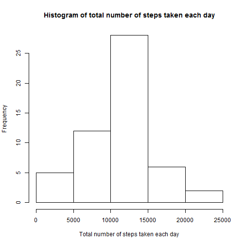
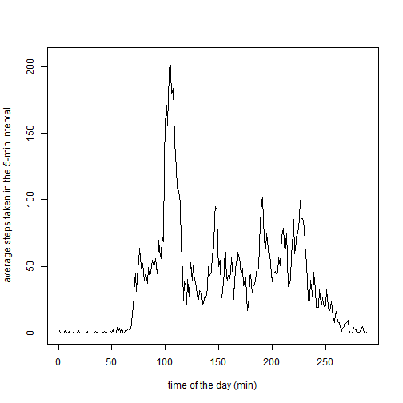
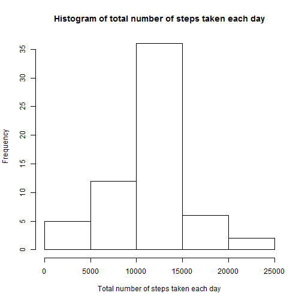
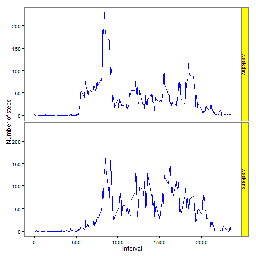

This is the report for the Peer Assessment 1 of Reproducible Research course.

## Loading and preprocessing the data
Download data from the assignment instrutcion page, and unzip the file into R working directory. Read data into R using code below.


```r
data <- read.csv("activity.csv",sep=",")
```

The data consists of 3 columns -- steps, date and interval. Missing values are noted as NA.


```r
head(data)
```

```
##   steps       date interval
## 1    NA 2012-10-01        0
## 2    NA 2012-10-01        5
## 3    NA 2012-10-01       10
## 4    NA 2012-10-01       15
## 5    NA 2012-10-01       20
## 6    NA 2012-10-01       25
```

## What is mean total number of steps taken per day?
To compute the mean, the following steps are taken:  
1. remove NAs from the dataset.  
2. sum up the number of steps taken within a day.  
3. calculate the mean and median of total number of steps taken per day.


```r
validdata <- na.omit(data)
stepperday <- tapply(validdata$steps,validdata$date,sum)
meanstepperday <- mean(stepperday,na.rm=TRUE)
medianstepperday <- median(stepperday,na.rm=TRUE)
```

### Mean and median of the total steps per day
By calculation, the mean total number of steps taken per day is 1.0766189 &times; 10<sup>4</sup>, and the median is 10765.

### Histogram of the total number of steps taken per day
The data distribution can be better demonstrated by the histogram.

```r
hist(stepperday,main="Histogram of total number of steps taken each day",xlab="Total number of steps taken each day")
```

 

## What is the average daily activity pattern?
### Time series plot of the average steps taken every interval
First, the number of steps taken per interval is averaged across all dates, with NA values removed (i.e., using validdata set).


```r
avestep <- tapply(validdata$steps,validdata$interval,mean)
```

The time series plot is then plotted as below.


```r
plot(avestep,type="l",xlab="time of the day (min)",ylab="average steps taken in the 5-min interval")
```

 

### Find out the interval containing the maximum number of steps
This can be realized by R code as follows.


```r
intrv <- as.numeric(which.max(avestep))
# the corresponding time of the day
intrvstart <- as.numeric(names(which.max(avestep)))
intrvend <- intrvstart+5
```

Therefore, the 104th interval contains the max number of steps, and this interval starts at the 835th minute, and ends at the 840th minute of the day.

## Imputing missing values
### Making new dataset with missing data filled
First of all, we need to make clear several questions: 
. how many data is missing?  
. are there days whose observations are all missing, or partially missing?  
These can be solved using R code as follows.


```r
# how many missing values?
numofmissing <- sum(is.na(data$steps))
# extract the date containing missing values
missdate <- unique(data[is.na(data$steps),2])
# is these date missing all or part of their measurements? if only miss part of the observation, the date should also shown in the validdata set.
misspart <- missdate %in% validdata$date
print(misspart)
```

```
## [1] FALSE FALSE FALSE FALSE FALSE FALSE FALSE FALSE
```

It is shown that there are 2304 missing observations. Those missing measurements are for days: 2012-10-01, 2012-10-08, 2012-11-01, 2012-11-04, 2012-11-09, 2012-11-10, 2012-11-14, 2012-11-30. Since all these days do not appear in the validdata set, it means a complete loss of measurement of these days.  
The impute scheme is to replace the NAs using the average number of steps per interval across all days.  
To calculate the average steps taken per interval, we first group the data by interval, and then take the mean of steps.  


```r
library(dplyr)
datagroup <- group_by(validdata,interval)
datagroupmean <- summarize(datagroup,mean(steps))
head(datagroupmean)
```

```
## Source: local data frame [6 x 2]
## 
##   interval mean(steps)
## 1        0   1.7169811
## 2        5   0.3396226
## 3       10   0.1320755
## 4       15   0.1509434
## 5       20   0.0754717
## 6       25   2.0943396
```

The next is to assign the means to the missing values.


```r
# initiate a column filled with repeated means
newsteps <- unlist(rep(datagroupmean[,2],times=length(levels(data$date))))
newdata <- mutate(data,nsteps=newsteps)
for (i in seq_along(newdata$interval)){
  if(!(is.na(newdata[i,1]))){
    newdata[i,4] <- newdata[i,1]
  }  
}
newdata[,1] <- newdata[,4]
newdata <- newdata[,-4]
# sum up steps for each day
newstepperday <- tapply(newdata$steps,newdata$date,sum)
```

Now the new dataset is created. Below is a preview of it.


```r
head(newdata)
```

```
##       steps       date interval
## 1 1.7169811 2012-10-01        0
## 2 0.3396226 2012-10-01        5
## 3 0.1320755 2012-10-01       10
## 4 0.1509434 2012-10-01       15
## 5 0.0754717 2012-10-01       20
## 6 2.0943396 2012-10-01       25
```

### make histogram of total steps taken each day and report mean and median


```r
hist(newstepperday,main="Histogram of total number of steps taken each day",xlab="Total number of steps taken each day")
```

 

The mean and median is calculated using code blow.

```r
# calc mean and median
newmeanstepperday <- mean(newstepperday)
newmedianstepperday <- median(newstepperday)
# compare with the mean and median obtained from Q1
identical(newmeanstepperday,meanstepperday)
```

```
## [1] TRUE
```

```r
identical(newmedianstepperday,medianstepperday)
```

```
## [1] FALSE
```

Therefore, the mean and median of the number of steps taken per day are not changed after imputting the missing data. This is due to the imputting scheme we choosed.

## Are there differences in activity patterns between weekdays and weekends?
### Create new dataset containing factor for weekday and weekend
The weekdays are firstly extracted from the "date" variable of previous dataset using weekdays() function. It is then divided into "weekend" and "weekday", and factorized. A new dataset wkdata is created.


```r
wkd <- weekdays(as.Date(newdata$date))
for (i in seq_along(wkd)){
  if(wkd[i] %in% c("Saturday","Sunday")){
    wkd[i] <- c("weekend")
  } else {wkd[i] <- c("weekday")}
}
wkdata <- mutate(newdata,weekdays=as.factor(wkd))
head(wkdata)
```

```
##       steps       date interval weekdays
## 1 1.7169811 2012-10-01        0  weekday
## 2 0.3396226 2012-10-01        5  weekday
## 3 0.1320755 2012-10-01       10  weekday
## 4 0.1509434 2012-10-01       15  weekday
## 5 0.0754717 2012-10-01       20  weekday
## 6 2.0943396 2012-10-01       25  weekday
```

Next, it is convenient to group the wkdata set by weekdays, and calculate the average number of steps taken in weekday and weekend.


```r
# group data
wkgroup <- group_by(wkdata,weekdays,interval)
wkavestep <- summarize(wkgroup,mean(steps))
names(wkavestep)[3] <- c("meansteps")
head(wkavestep)
```

```
## Source: local data frame [6 x 3]
## Groups: weekdays
## 
##   weekdays interval  meansteps
## 1  weekday        0 2.25115304
## 2  weekday        5 0.44528302
## 3  weekday       10 0.17316562
## 4  weekday       15 0.19790356
## 5  weekday       20 0.09895178
## 6  weekday       25 1.59035639
```

### Make panel plot for weekend and weekday


```r
library(ggplot2)
g <- ggplot(data=wkavestep,aes(interval,meansteps))+geom_line(colour="blue")+facet_grid(weekdays~.)
g2 <- g + labs(x="Interval",y="Number of steps") + theme_bw() + theme(axis.ticks=element_line(size=1))
g3 <- g2 + theme(panel.grid=element_blank()) + theme(strip.background=element_rect(fill="yellow"))
print(g3)
```

 

From the plot, we can see that the number of steps people taken during weekdays are more "concentrated" than that during weekends.  

